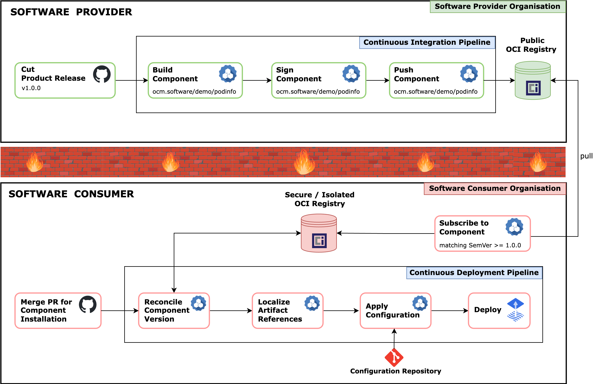
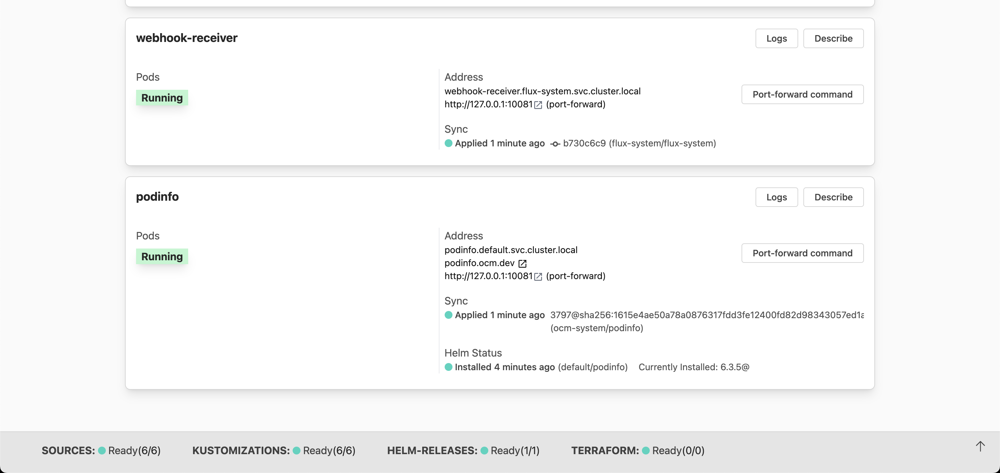

[](https://api.reuse.software/info/github.com/open-component-model/demo-secure-delivery)

# Secure software delivery with Flux and Open Component Model

## Fully guided walkthrough



This walkthrough deploys a full end-to-end scenario demonstrating how OCM and Flux can be employed to continuously deploy applications in air-gapped environments.

The demo environment consists of Gitea, Tekton, Flux and the OCM controller.

To be able to show that provider and consumer are really disconnected, two distinct Gitea organizations are created:
- [software-provider](https://gitea.ocm.dev/software-provider)
- [software-consumer](https://gitea.ocm.dev/software-consumer)

## Software Provider

The provider organization contains a repository which models the `podinfo` application. When a new release is created a Tekton pipeline will be triggered that builds the OCM component and pushes it to the [software provider's OCI registry](https://gitea.ocm.dev/software-provider/-/packages).

## Software Consumer

The software consumer organization models an air-gapped scenario where applications are deployed from a secure OCI registry rather than directly from an arbitrary public upstream source.

The software consumer organization contains a repository named [ocm-applications](https://gitea.ocm.dev/software-consumer/ocm-applications). During the setup of the demo a PR is created which contains a set of Kubernetes manifests required to deploy the OCM component published by the software provider.

Once this pull request is merged the Flux machinery will deploy `podinfo` component. [Capacitor](https://capacitor.ocm.dev) can be used to understand the state of the cluster.

### Walkthrough

Instructions are provided to guide you through the process of deploying the demo environment, cutting a release for "podinfo," verifying the release automation, installing the component, viewing the Capacitor GitOps dashboard, accessing the deployed application, applying configuration changes, monitoring the application update, and cutting a new release with updated features.

#### 1. Setup demo environment

To deploy the demo environment execute the following:

`make run`

Once the environment has been created, login to Gitea using the following credentials:

```
username: ocm-admin
password: password
```

#### 2. Cut a release for `podinfo`

Next navigate to: https://gitea.ocm.dev/software-provider/podinfo-component/releases and click "New Release".

Enter "v1.0.0" for both the tag name and release name, and then click "Publish Release".


#### 3. Verify the release

Once the release is published, navigate to https://ci.ocm.dev/#/namespaces/tekton-pipelines/pipelineruns and follow the progress of the release automation.


#### 4. Install the Component

When the release pipeline has been completed we can install the component. Navigate to https://gitea.ocm.dev/software-consumer/ocm-applications/pulls/1 and merge the pull request.


#### 5. View the Capacitor Dashboard

After certificates are created the Capacitor component and the dashboard will be accessible at https://capacitor.ocm.dev. Give it a minute to spin up...



#### 5. View the application

We can view the `podinfo` Helm release that's been deployed in the default namespace: https://capacitor.ocm.dev/

We can also view the running application at https://podinfo.ocm.dev


#### 6. Apply configuration

The application can be configured using the parameters exposed in `values.yaml`. Now that podinfo is deployed we can tweak a few parameters.
Navigate to https://gitea.ocm.dev/software-consumer/ocm-applications/_edit/main/values.yaml


and add the following:

```yaml
podinfo:
  replicas: 2
  message: "Hello Open Component Model!"
  serviceAccountName: ocm-ops
```

#### 7. View the configured application

The changes will soon be reconciled by Flux and visible at https://podinfo.ocm.dev. Note how the pod id changes now that we have 2 replicas of our application running.


#### 8. Cut a new release

Let's jump back to the provider repository and cut another release. This release will contain a new feature that changes the image displayed by the podinfo application. Follow the same process as before to create a release, bumping the version to `v1.1.0`.

#### 9. Verify the release

Once the release is published, navigate to https://ci.ocm.dev/#/namespaces/tekton-pipelines/pipelineruns and follow the progress of the release automation.

#### 10. Monitor the application update

Jump back to https://capacitor.ocm.dev to view the rollout of the new release.


#### 11. View the updated application

Finally, navigate to https://podinfo.ocm.dev which now displays the OCM logo in place of the cuttlefish and the updated application version of 6.3.6


### Conclusion

By leveraging the capabilities of Gitea, Tekton, Flux, and the OCM controller, this demo showcases the seamless deployment of components and dependencies in a secure manner. The use of secure OCI registries and automated release pipelines ensures the integrity and reliability of the deployment process.

Users can easily set up the demo environment, cut releases, monitor release automation, view the Capacitor GitOps dashboard and observe the deployment and update of applications. We have presented a practical illustration of how OCM and Flux can be employed to facilitate the deployment and management of applications in air-gapped environments, offering a robust and efficient solution for secure software delivery.

## Contributing

Code contributions, feature requests, bug reports, and help requests are very welcome. Please refer to the [Contributing Guide in the Community repository](https://github.com/open-component-model/community/blob/main/CONTRIBUTING.md) for more information on how to contribute to OCM.

OCM follows the [CNCF Code of Conduct](https://github.com/cncf/foundation/blob/main/code-of-conduct.md).

## Licensing

Copyright 2022-2023 SAP SE or an SAP affiliate company and Open Component Model contributors.
Please see our [LICENSE](LICENSE) for copyright and license information.
Detailed information including third-party components and their licensing/copyright information is available [via the REUSE tool](https://api.reuse.software/info/github.com/open-component-model/demo-secure-delivery).
